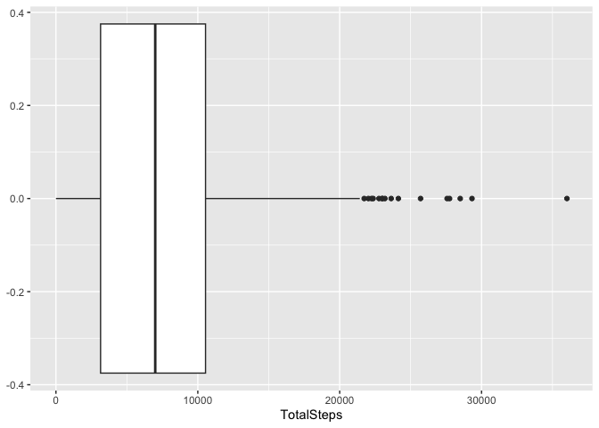

# Bellabeat Case Study

## Background Information

**Bellabeat** is a high-tech company that manufactures health-focused
smart products. Collecting data on activity, sleep, stress, and
reproductive health has allowed Bellabeat to empower women with
knowledge about their own health and habits.

### Business Task

Sršen, the company’s cofounder, would like an analysis of Bellabeat’s
available consumer data to identify opportunities for growth. She has
asked the marketing analytics team to analyze smart device usage data in
order to gain insight into how people are already using their smart
devices. Then, using this information, she would like recommendations
for how these trends can inform Bellabeat marketing strategy. Therefore,
in this case study, I will answer the following questions:

1.  What are some trends in smart device usage?
2.  How can these trends help influence Bellabeat marketing strategy?

### About the Data

The data for this case study comes from [Fitbit Fitness Tracker
Data](https://www.kaggle.com/datasets/arashnic/fitbit), a public domain
dataset available on Kaggle. It contains personal fitness tracker
information from 30 FitBit users. These 30 Fitbit users consented to the
submission of all personal tracker data contained in this dataset.

I will import the data set from Kaggle into RStudio where I can clean,
filter, and analyze the data.

### Limitations

-   Sample size: 30 people is not a large enough sample to be
    representative of all FitBit users
-   Outdated: The dataset contains data from a one month period in 2016
    only. For a deeper and more accurate analysis of trends, we would
    need data from the current year, preferably collected for an entire
    year to look at if trends vary during different times of year.
-   Limited: The dataset does not contain any demographic information
    about the users, including gender, age, or location, which would be
    beneficial for marketing purposes to target specific customers

## Data Preparation

I can see that there are two folders of data, lets merge the files that
have the same name and

``` r
# Define the paths to the two folders
folder1 <- "/cloud/project/archive/Fitabase Data 3.12.16-4.11.16"
folder2 <- "/cloud/project/archive/Fitabase Data 4.12.16-5.12.16"

# List all files in both folders
files1 <- list.files(folder1, full.names = TRUE)
files2 <- list.files(folder2, full.names = TRUE)

# Get the file names without the path
names1 <- basename(files1)
names2 <- basename(files2)

# Find the common file names
common_files <- intersect(names1, names2)
```

Now I moved all the unique files into the work folder so that further
analysis can be done

``` r
library(dplyr)
```

    ## 
    ## Attaching package: 'dplyr'

    ## The following objects are masked from 'package:stats':
    ## 
    ##     filter, lag

    ## The following objects are masked from 'package:base':
    ## 
    ##     intersect, setdiff, setequal, union

``` r
# Loop over the common file names
for (file in common_files) {
  # Construct the full paths for both files
  file1_path <- file.path(folder1, file)
  file2_path <- file.path(folder2, file)
  
  # Read the files
  df1 <- read.csv(file1_path)
  df2 <- read.csv(file2_path)
  
  # Merge the data frames row-wise
  merged_df <- bind_rows(df1, df2)
  
  # Save the merged file
  write.csv(merged_df, file.path("/cloud/project/archive", file), row.names = FALSE)
}

# Define the paths to the two folders
folder1 <- "/cloud/project/archive/Fitabase Data 3.12.16-4.11.16"
folder2 <- "/cloud/project/archive/Fitabase Data 4.12.16-5.12.16"
new_folder <- "/cloud/project/archive"

# List all files in both folders
files1 <- list.files(folder1, full.names = TRUE)
files2 <- list.files(folder2, full.names = TRUE)

# Get the file names without the path
names1 <- basename(files1)
names2 <- basename(files2)

# Find the unique file names in folder2
unique_files <- setdiff(names2, names1)

# Loop over the unique file names
for (file in unique_files) {
  # Construct the full path for the file in folder2
  file2_path <- file.path(folder2, file)
  
  # Move the file to the new folder
  file.copy(file2_path, file.path(new_folder, file))
  
  # Optionally, remove the file from folder2
  file.remove(file2_path)
}
```

Now lets start the analysis

## Data Preparation

1.  load packages

``` r
  library(tidyverse)
```

    ## ── Attaching core tidyverse packages ──────────────────────── tidyverse 2.0.0 ──
    ## ✔ forcats   1.0.0     ✔ readr     2.1.5
    ## ✔ ggplot2   3.5.1     ✔ stringr   1.5.1
    ## ✔ lubridate 1.9.3     ✔ tibble    3.2.1
    ## ✔ purrr     1.0.2     ✔ tidyr     1.3.1
    ## ── Conflicts ────────────────────────────────────────── tidyverse_conflicts() ──
    ## ✖ dplyr::filter() masks stats::filter()
    ## ✖ dplyr::lag()    masks stats::lag()
    ## ℹ Use the conflicted package (<http://conflicted.r-lib.org/>) to force all conflicts to become errors

``` r
  library(ggplot2)
  library(lubridate)
  library(lm.beta)
```

1.  Load CSV files containing our data

``` r
  # load files
  daily_activity <- read.csv("./archive/dailyActivity_merged.csv")
  hourly_steps <- read.csv("./archive/hourlySteps_merged.csv")
  daily_sleep <- read.csv("./archive/sleepDay_merged.csv")
  weight <- read.csv("./archive/weightLogInfo_merged.csv")
```

1.  Identify number of participants in each data set by counting
    distinct IDs

``` r
  n_distinct(daily_activity$Id)
```

    ## [1] 35

``` r
  n_distinct(hourly_steps$Id)
```

    ## [1] 35

``` r
  n_distinct(daily_sleep$Id)
```

    ## [1] 24

``` r
  n_distinct(weight$Id)
```

    ## [1] 13

1.  View and clean up the data sets

``` r
  # First, the daily_sleep data
  head(daily_sleep)
```

    ##           Id              SleepDay TotalSleepRecords TotalMinutesAsleep
    ## 1 1503960366 4/12/2016 12:00:00 AM                 1                327
    ## 2 1503960366 4/13/2016 12:00:00 AM                 2                384
    ## 3 1503960366 4/15/2016 12:00:00 AM                 1                412
    ## 4 1503960366 4/16/2016 12:00:00 AM                 2                340
    ## 5 1503960366 4/17/2016 12:00:00 AM                 1                700
    ## 6 1503960366 4/19/2016 12:00:00 AM                 1                304
    ##   TotalTimeInBed
    ## 1            346
    ## 2            407
    ## 3            442
    ## 4            367
    ## 5            712
    ## 6            320

``` r
  # The 12:00:00 AM time stamp on each observation is redundant so we should remove it to make the  data easier to work with
  daily_sleep$SleepDay <- (gsub('12:00:00 AM', '', daily_sleep$SleepDay))
  # Renaming column
  colnames(daily_sleep)[2] = "Date"
  # View updated data
  head(daily_sleep)
```

    ##           Id       Date TotalSleepRecords TotalMinutesAsleep TotalTimeInBed
    ## 1 1503960366 4/12/2016                  1                327            346
    ## 2 1503960366 4/13/2016                  2                384            407
    ## 3 1503960366 4/15/2016                  1                412            442
    ## 4 1503960366 4/16/2016                  2                340            367
    ## 5 1503960366 4/17/2016                  1                700            712
    ## 6 1503960366 4/19/2016                  1                304            320

``` r
  # Next, the daily_activity data
  head(daily_activity)
```

    ##           Id ActivityDate TotalSteps TotalDistance TrackerDistance
    ## 1 1503960366    3/25/2016      11004          7.11            7.11
    ## 2 1503960366    3/26/2016      17609         11.55           11.55
    ## 3 1503960366    3/27/2016      12736          8.53            8.53
    ## 4 1503960366    3/28/2016      13231          8.93            8.93
    ## 5 1503960366    3/29/2016      12041          7.85            7.85
    ## 6 1503960366    3/30/2016      10970          7.16            7.16
    ##   LoggedActivitiesDistance VeryActiveDistance ModeratelyActiveDistance
    ## 1                        0               2.57                     0.46
    ## 2                        0               6.92                     0.73
    ## 3                        0               4.66                     0.16
    ## 4                        0               3.19                     0.79
    ## 5                        0               2.16                     1.09
    ## 6                        0               2.36                     0.51
    ##   LightActiveDistance SedentaryActiveDistance VeryActiveMinutes
    ## 1                4.07                       0                33
    ## 2                3.91                       0                89
    ## 3                3.71                       0                56
    ## 4                4.95                       0                39
    ## 5                4.61                       0                28
    ## 6                4.29                       0                30
    ##   FairlyActiveMinutes LightlyActiveMinutes SedentaryMinutes Calories
    ## 1                  12                  205              804     1819
    ## 2                  17                  274              588     2154
    ## 3                   5                  268              605     1944
    ## 4                  20                  224             1080     1932
    ## 5                  28                  243              763     1886
    ## 6                  13                  223             1174     1820

``` r
  # The LoggedActivitiesDistance and SedentaryActiveDistance columns don't provide much information
  #   so we will not use them in our analysis and can remove them
  daily_activity <- daily_activity[c(-6, -10)]
  # Renaming column
  colnames(daily_activity)[2] = "Date"
  # View updated Data
  head(daily_activity)
```

    ##           Id      Date TotalSteps TotalDistance TrackerDistance
    ## 1 1503960366 3/25/2016      11004          7.11            7.11
    ## 2 1503960366 3/26/2016      17609         11.55           11.55
    ## 3 1503960366 3/27/2016      12736          8.53            8.53
    ## 4 1503960366 3/28/2016      13231          8.93            8.93
    ## 5 1503960366 3/29/2016      12041          7.85            7.85
    ## 6 1503960366 3/30/2016      10970          7.16            7.16
    ##   VeryActiveDistance ModeratelyActiveDistance LightActiveDistance
    ## 1               2.57                     0.46                4.07
    ## 2               6.92                     0.73                3.91
    ## 3               4.66                     0.16                3.71
    ## 4               3.19                     0.79                4.95
    ## 5               2.16                     1.09                4.61
    ## 6               2.36                     0.51                4.29
    ##   VeryActiveMinutes FairlyActiveMinutes LightlyActiveMinutes SedentaryMinutes
    ## 1                33                  12                  205              804
    ## 2                89                  17                  274              588
    ## 3                56                   5                  268              605
    ## 4                39                  20                  224             1080
    ## 5                28                  28                  243              763
    ## 6                30                  13                  223             1174
    ##   Calories
    ## 1     1819
    ## 2     2154
    ## 3     1944
    ## 4     1932
    ## 5     1886
    ## 6     1820

``` r
  # Finally, the hourly_steps data
  head(hourly_steps)
```

    ##           Id          ActivityHour StepTotal
    ## 1 1503960366 3/12/2016 12:00:00 AM         0
    ## 2 1503960366  3/12/2016 1:00:00 AM         0
    ## 3 1503960366  3/12/2016 2:00:00 AM         0
    ## 4 1503960366  3/12/2016 3:00:00 AM         0
    ## 5 1503960366  3/12/2016 4:00:00 AM         0
    ## 6 1503960366  3/12/2016 5:00:00 AM         0

``` r
  # In this case, the time associated with the date is relevant so we don't want to remove it,
  #   but the data may be easier to work with if we separate it into it's own column
  hourly_steps <- hourly_steps%>% separate(ActivityHour, c("Date", "Hour"), sep = "^\\S*\\K")
  # View the updated dataframe
  head(hourly_steps)
```

    ##           Id      Date         Hour StepTotal
    ## 1 1503960366 3/12/2016  12:00:00 AM         0
    ## 2 1503960366 3/12/2016   1:00:00 AM         0
    ## 3 1503960366 3/12/2016   2:00:00 AM         0
    ## 4 1503960366 3/12/2016   3:00:00 AM         0
    ## 5 1503960366 3/12/2016   4:00:00 AM         0
    ## 6 1503960366 3/12/2016   5:00:00 AM         0

Because the Id variable is currently numerical but should be treated as
nominal,we need to change how it is formatted in each data set.

``` r
  daily_activity$Id <- as.character(daily_activity$Id)
  daily_sleep$Id <- as.character(daily_sleep$Id)
  hourly_steps$Id <- as.character(hourly_steps$Id)
```

## Data Exploration

1.  Graph variables of interest, check for outliers in the data

``` r
summary(daily_activity$TotalSteps)
```

    ##    Min. 1st Qu.  Median    Mean 3rd Qu.    Max. 
    ##       0    3146    6999    7281   10544   36019

``` r
ggplot(daily_activity, aes(x = TotalSteps)) +
  geom_boxplot()
```



``` r
# Most of the daily total steps appear to be around 4000-11000.
#   There appear to be possible outliers on the high end

steps_upper <- quantile(daily_activity$TotalSteps, .9985, na.rm = TRUE)
# This shows that 99.85% of the observations are at 28,680 or below. 
# Values above this number are more than 3 standard deviations from the mean, 
#   indicating they are outliers. 

daily_activity <- subset(daily_activity, TotalSteps <= 28680)
# 2 outliers were removed
```

1.  Extract more information by running descriptive statistics

#### Sleep Data

-   What is the average amount of sleep for each participant?

``` r
mean_sleep <- daily_sleep %>%
  group_by(Id) %>%
  summarize(mean_sleep = mean(TotalMinutesAsleep)) %>%
  select(Id, mean_sleep) %>%
  arrange(mean_sleep) %>%
  as.data.frame()
head(mean_sleep)
```

    ##           Id mean_sleep
    ## 1 2320127002    61.0000
    ## 2 7007744171    68.5000
    ## 3 4558609924   127.6000
    ## 4 3977333714   293.6429
    ## 5 1644430081   294.0000
    ## 6 8053475328   297.0000

-   What percent of the time did participants actually spend sleeping
    while laying in bed?

``` r
daily_sleep %>%
  group_by(Id) %>%
  mutate(percent_sleep = (TotalMinutesAsleep/TotalTimeInBed)*100) %>%
  select(Id, percent_sleep) %>%
  summarize(avg_persleep = mean(percent_sleep)) %>%
  arrange(avg_persleep) %>%
  mutate_if(is.numeric, round, 2)
```

    ## # A tibble: 24 × 2
    ##    Id         avg_persleep
    ##    <chr>             <dbl>
    ##  1 3977333714         63.4
    ##  2 1844505072         67.8
    ##  3 1644430081         88.2
    ##  4 2320127002         88.4
    ##  5 4558609924         90.7
    ##  6 2347167796         91.0
    ##  7 5553957443         91.5
    ##  8 8378563200         91.9
    ##  9 4445114986         92.5
    ## 10 4020332650         93.0
    ## # ℹ 14 more rows

``` r
# Most participants slept for at least 90% of the time they spent in bed, with
#   only 4 participants spending a smaller percent of time sleeping, the lowest
#   being 63.37%
```
