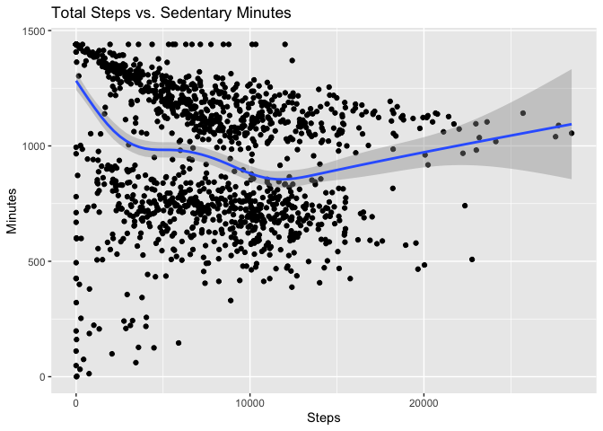
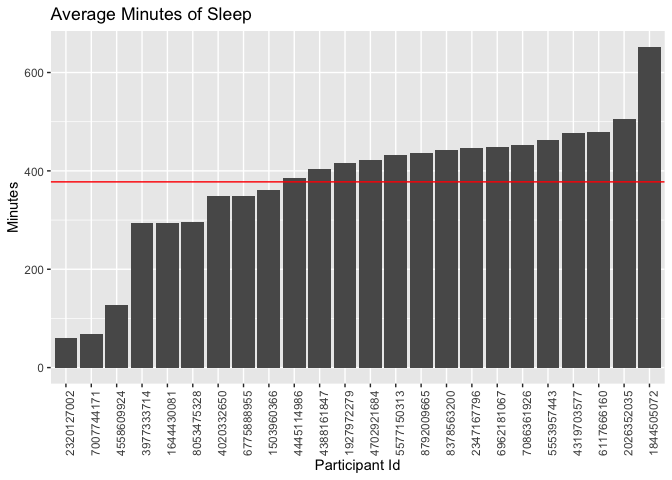
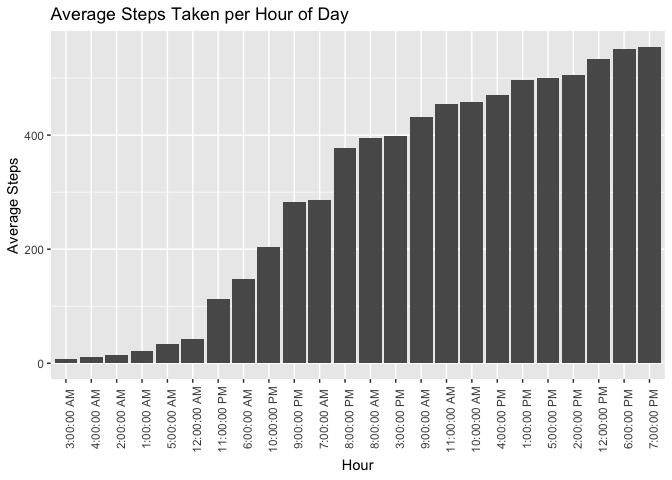
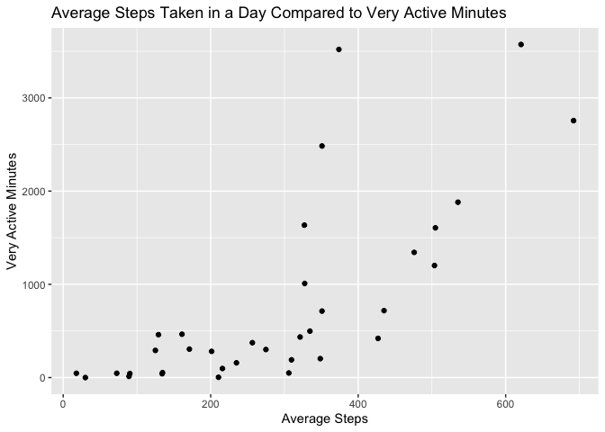

# Bellabeat Case Study

## Background Information

**Bellabeat** is a high-tech company that manufactures health-focused
smart products. Collecting data on activity, sleep, stress, and
reproductive health has allowed Bellabeat to empower women with
knowledge about their own health and habits.

### Business Task

Sršen, the company’s cofounder, would like an analysis of Bellabeat’s
available consumer data to identify opportunities for growth. She has
asked the marketing analytics team to analyze smart device usage data in
order to gain insight into how people are already using their smart
devices. Then, using this information, she would like recommendations
for how these trends can inform Bellabeat marketing strategy. Therefore,
in this case study, I will answer the following questions:

1.  What are some trends in smart device usage?
2.  How can these trends help influence Bellabeat marketing strategy?

### About the Data

The data for this case study comes from [Fitbit Fitness Tracker
Data](https://www.kaggle.com/datasets/arashnic/fitbit), a public domain
dataset available on Kaggle. It contains personal fitness tracker
information from 30 FitBit users. These 30 Fitbit users consented to the
submission of all personal tracker data contained in this dataset.

I will import the data set from Kaggle into RStudio where I can clean,
filter, and analyze the data.

### Limitations

- Sample size: 30 people is not a large enough sample to be
  representative of all FitBit users
- Outdated: The dataset contains data from a one month period in 2016
  only. For a deeper and more accurate analysis of trends, we would need
  data from the current year, preferably collected for an entire year to
  look at if trends vary during different times of year.
- Limited: The dataset does not contain any demographic information
  about the users, including gender, age, or location, which would be
  beneficial for marketing purposes to target specific customers

## Data Preparation

I can see that there are two folders of data, lets merge the files that
have the same name and

``` r
# Define the paths to the two folders
folder1 <- "/cloud/project/archive/Fitabase Data 3.12.16-4.11.16"
folder2 <- "/cloud/project/archive/Fitabase Data 4.12.16-5.12.16"

# List all files in both folders
files1 <- list.files(folder1, full.names = TRUE)
files2 <- list.files(folder2, full.names = TRUE)

# Get the file names without the path
names1 <- basename(files1)
names2 <- basename(files2)

# Find the common file names
common_files <- intersect(names1, names2)
```

Now I moved all the unique files into the work folder so that further
analysis can be done

``` r
library(dplyr)

# Loop over the common file names
for (file in common_files) {
  # Construct the full paths for both files
  file1_path <- file.path(folder1, file)
  file2_path <- file.path(folder2, file)
  
  # Read the files
  df1 <- read.csv(file1_path)
  df2 <- read.csv(file2_path)
  
  # Merge the data frames row-wise
  merged_df <- bind_rows(df1, df2)
  
  # Save the merged file
  write.csv(merged_df, file.path("/cloud/project/archive", file), row.names = FALSE)
}

# Define the paths to the two folders
folder1 <- "/cloud/project/archive/Fitabase Data 3.12.16-4.11.16"
folder2 <- "/cloud/project/archive/Fitabase Data 4.12.16-5.12.16"
new_folder <- "/cloud/project/archive"

# List all files in both folders
files1 <- list.files(folder1, full.names = TRUE)
files2 <- list.files(folder2, full.names = TRUE)

# Get the file names without the path
names1 <- basename(files1)
names2 <- basename(files2)

# Find the unique file names in folder2
unique_files <- setdiff(names2, names1)

# Loop over the unique file names
for (file in unique_files) {
  # Construct the full path for the file in folder2
  file2_path <- file.path(folder2, file)
  
  # Move the file to the new folder
  file.copy(file2_path, file.path(new_folder, file))
  
  # Optionally, remove the file from folder2
  file.remove(file2_path)
}
```

Now lets start the analysis

## Data Preparation

1.  load packages

``` r
  library(tidyverse)
  library(ggplot2)
  library(lubridate)
  library(lm.beta)
```

2.  Load CSV files containing our data

``` r
  # load files
  daily_activity <- read.csv("./archive/dailyActivity_merged.csv")
  hourly_steps <- read.csv("./archive/hourlySteps_merged.csv")
  daily_sleep <- read.csv("./archive/sleepDay_merged.csv")
  weight <- read.csv("./archive/weightLogInfo_merged.csv")
```

3.  Identify number of participants in each data set by counting
    distinct IDs

``` r
  n_distinct(daily_activity$Id)
```

    ## [1] 35

``` r
  n_distinct(hourly_steps$Id)
```

    ## [1] 35

``` r
  n_distinct(daily_sleep$Id)
```

    ## [1] 24

``` r
  n_distinct(weight$Id)
```

    ## [1] 13

4.  View and clean up the data sets

``` r
  # First, the daily_sleep data
  head(daily_sleep)
```

    ##           Id              SleepDay TotalSleepRecords TotalMinutesAsleep TotalTimeInBed
    ## 1 1503960366 4/12/2016 12:00:00 AM                 1                327            346
    ## 2 1503960366 4/13/2016 12:00:00 AM                 2                384            407
    ## 3 1503960366 4/15/2016 12:00:00 AM                 1                412            442
    ## 4 1503960366 4/16/2016 12:00:00 AM                 2                340            367
    ## 5 1503960366 4/17/2016 12:00:00 AM                 1                700            712
    ## 6 1503960366 4/19/2016 12:00:00 AM                 1                304            320

``` r
  # The 12:00:00 AM time stamp on each observation is redundant so we should remove it to make the  data easier to work with
  daily_sleep$SleepDay <- (gsub('12:00:00 AM', '', daily_sleep$SleepDay))
  # Renaming column
  colnames(daily_sleep)[2] = "Date"
  # View updated data
  head(daily_sleep)
```

    ##           Id       Date TotalSleepRecords TotalMinutesAsleep TotalTimeInBed
    ## 1 1503960366 4/12/2016                  1                327            346
    ## 2 1503960366 4/13/2016                  2                384            407
    ## 3 1503960366 4/15/2016                  1                412            442
    ## 4 1503960366 4/16/2016                  2                340            367
    ## 5 1503960366 4/17/2016                  1                700            712
    ## 6 1503960366 4/19/2016                  1                304            320

``` r
  # Next, the daily_activity data
  head(daily_activity)
```

    ##           Id ActivityDate TotalSteps TotalDistance TrackerDistance LoggedActivitiesDistance
    ## 1 1503960366    3/25/2016      11004          7.11            7.11                        0
    ## 2 1503960366    3/26/2016      17609         11.55           11.55                        0
    ## 3 1503960366    3/27/2016      12736          8.53            8.53                        0
    ## 4 1503960366    3/28/2016      13231          8.93            8.93                        0
    ## 5 1503960366    3/29/2016      12041          7.85            7.85                        0
    ## 6 1503960366    3/30/2016      10970          7.16            7.16                        0
    ##   VeryActiveDistance ModeratelyActiveDistance LightActiveDistance SedentaryActiveDistance
    ## 1               2.57                     0.46                4.07                       0
    ## 2               6.92                     0.73                3.91                       0
    ## 3               4.66                     0.16                3.71                       0
    ## 4               3.19                     0.79                4.95                       0
    ## 5               2.16                     1.09                4.61                       0
    ## 6               2.36                     0.51                4.29                       0
    ##   VeryActiveMinutes FairlyActiveMinutes LightlyActiveMinutes SedentaryMinutes Calories
    ## 1                33                  12                  205              804     1819
    ## 2                89                  17                  274              588     2154
    ## 3                56                   5                  268              605     1944
    ## 4                39                  20                  224             1080     1932
    ## 5                28                  28                  243              763     1886
    ## 6                30                  13                  223             1174     1820

``` r
  # The LoggedActivitiesDistance and SedentaryActiveDistance columns don't provide much information
  #   so we will not use them in our analysis and can remove them
  daily_activity <- daily_activity[c(-6, -10)]
  # Renaming column
  colnames(daily_activity)[2] = "Date"
  # View updated Data
  head(daily_activity)
```

    ##           Id      Date TotalSteps TotalDistance TrackerDistance VeryActiveDistance
    ## 1 1503960366 3/25/2016      11004          7.11            7.11               2.57
    ## 2 1503960366 3/26/2016      17609         11.55           11.55               6.92
    ## 3 1503960366 3/27/2016      12736          8.53            8.53               4.66
    ## 4 1503960366 3/28/2016      13231          8.93            8.93               3.19
    ## 5 1503960366 3/29/2016      12041          7.85            7.85               2.16
    ## 6 1503960366 3/30/2016      10970          7.16            7.16               2.36
    ##   ModeratelyActiveDistance LightActiveDistance VeryActiveMinutes FairlyActiveMinutes
    ## 1                     0.46                4.07                33                  12
    ## 2                     0.73                3.91                89                  17
    ## 3                     0.16                3.71                56                   5
    ## 4                     0.79                4.95                39                  20
    ## 5                     1.09                4.61                28                  28
    ## 6                     0.51                4.29                30                  13
    ##   LightlyActiveMinutes SedentaryMinutes Calories
    ## 1                  205              804     1819
    ## 2                  274              588     2154
    ## 3                  268              605     1944
    ## 4                  224             1080     1932
    ## 5                  243              763     1886
    ## 6                  223             1174     1820

``` r
  # Finally, the hourly_steps data
  head(hourly_steps)
```

    ##           Id          ActivityHour StepTotal
    ## 1 1503960366 3/12/2016 12:00:00 AM         0
    ## 2 1503960366  3/12/2016 1:00:00 AM         0
    ## 3 1503960366  3/12/2016 2:00:00 AM         0
    ## 4 1503960366  3/12/2016 3:00:00 AM         0
    ## 5 1503960366  3/12/2016 4:00:00 AM         0
    ## 6 1503960366  3/12/2016 5:00:00 AM         0

``` r
  # In this case, the time associated with the date is relevant so we don't want to remove it,
  #   but the data may be easier to work with if we separate it into it's own column
  hourly_steps <- hourly_steps%>% separate(ActivityHour, c("Date", "Hour"), sep = "^\\S*\\K")
  # View the updated dataframe
  head(hourly_steps)
```

    ##           Id      Date         Hour StepTotal
    ## 1 1503960366 3/12/2016  12:00:00 AM         0
    ## 2 1503960366 3/12/2016   1:00:00 AM         0
    ## 3 1503960366 3/12/2016   2:00:00 AM         0
    ## 4 1503960366 3/12/2016   3:00:00 AM         0
    ## 5 1503960366 3/12/2016   4:00:00 AM         0
    ## 6 1503960366 3/12/2016   5:00:00 AM         0

Because the Id variable is currently numerical but should be treated as
nominal,we need to change how it is formatted in each data set.

``` r
  daily_activity$Id <- as.character(daily_activity$Id)
  daily_sleep$Id <- as.character(daily_sleep$Id)
  hourly_steps$Id <- as.character(hourly_steps$Id)
```

## Data Exploration

1.  Graph variables of interest, check for outliers in the data

``` r
summary(daily_activity$TotalSteps)
```

    ##    Min. 1st Qu.  Median    Mean 3rd Qu.    Max. 
    ##       0    3146    6999    7281   10544   36019

``` r
ggplot(daily_activity, aes(x = TotalSteps)) +
  geom_boxplot()
```

<!-- -->

``` r
# Most of the daily total steps appear to be around 4000-11000.
#   There appear to be possible outliers on the high end

steps_upper <- quantile(daily_activity$TotalSteps, .9985, na.rm = TRUE)
# This shows that 99.85% of the observations are at 28,680 or below. 
# Values above this number are more than 3 standard deviations from the mean, 
#   indicating they are outliers. 

daily_activity <- subset(daily_activity, TotalSteps <= 28680)
# 2 outliers were removed
```

2.  Extract more information by running descriptive statistics

#### Sleep Data

- What is the average amount of sleep for each participant?

``` r
mean_sleep <- daily_sleep %>%
  group_by(Id) %>%
  summarize(mean_sleep = mean(TotalMinutesAsleep)) %>%
  select(Id, mean_sleep) %>%
  arrange(mean_sleep) %>%
  as.data.frame()
head(mean_sleep)
```

    ##           Id mean_sleep
    ## 1 2320127002    61.0000
    ## 2 7007744171    68.5000
    ## 3 4558609924   127.6000
    ## 4 3977333714   293.6429
    ## 5 1644430081   294.0000
    ## 6 8053475328   297.0000

- What percent of the time did participants actually spend sleeping
  while laying in bed?

``` r
daily_sleep %>%
  group_by(Id) %>%
  mutate(percent_sleep = (TotalMinutesAsleep/TotalTimeInBed)*100) %>%
  select(Id, percent_sleep) %>%
  summarize(avg_persleep = mean(percent_sleep)) %>%
  arrange(avg_persleep) %>%
  mutate_if(is.numeric, round, 2)
```

    ## # A tibble: 24 × 2
    ##    Id         avg_persleep
    ##    <chr>             <dbl>
    ##  1 3977333714         63.4
    ##  2 1844505072         67.8
    ##  3 1644430081         88.2
    ##  4 2320127002         88.4
    ##  5 4558609924         90.7
    ##  6 2347167796         91.0
    ##  7 5553957443         91.5
    ##  8 8378563200         91.9
    ##  9 4445114986         92.5
    ## 10 4020332650         93.0
    ## # ℹ 14 more rows

``` r
# Most participants slept for at least 90% of the time they spent in bed, with
#   only 4 participants spending a smaller percent of time sleeping, the lowest
#   being 63.37%
```

#### Activity Levels

- Summary stats of different activity levels:

``` r
library(psych)

activity_level <- daily_activity[9:12]
describe(activity_level)
```

    ##                      vars    n   mean     sd median trimmed    mad min  max range  skew kurtosis
    ## VeryActiveMinutes       1 1395  19.51  31.32      2   12.52   2.97   0  210   210  2.22     6.00
    ## FairlyActiveMinutes     2 1395  13.36  26.38      6    8.67   8.90   0  660   660 11.67   259.61
    ## LightlyActiveMinutes    3 1395 185.21 113.95    195  184.14 109.71   0  720   720  0.09    -0.10
    ## SedentaryMinutes        4 1395 992.60 313.51   1058 1003.61 412.16   0 1440  1440 -0.32    -0.66
    ##                        se
    ## VeryActiveMinutes    0.84
    ## FairlyActiveMinutes  0.71
    ## LightlyActiveMinutes 3.05
    ## SedentaryMinutes     8.39

- Activity levels by participant

``` r
activity_id <- daily_activity %>%
  group_by(Id) %>%
  summarize(sum_very = sum(VeryActiveMinutes),
            sum_fairly = sum(FairlyActiveMinutes),
            sum_lightly = sum(LightlyActiveMinutes),
            sum_sed = sum(SedentaryMinutes)) %>%
  select(Id, sum_very, sum_fairly, sum_lightly, sum_sed) %>%
  as.data.frame()
head(activity_id)
```

    ##           Id sum_very sum_fairly sum_lightly sum_sed
    ## 1 1503960366     1881        895       11154   41680
    ## 2 1624580081       97        128        6887   62258
    ## 3 1644430081      435       1076        7631   45198
    ## 4 1844505072       13         49        5481   49829
    ## 5 1927972279       41         44        2536   52275
    ## 6 2022484408     1606        870       11027   47197

#### Steps

- On average, during which hour of the day were the most steps taken?

``` r
hourly_steps %>%
  group_by(Hour) %>%
  summarize(mean_steps = mean(StepTotal)) %>%
  select(Hour, mean_steps) %>%
  arrange(desc(mean_steps)) %>%
  head(1)
```

    ## # A tibble: 1 × 2
    ##   Hour          mean_steps
    ##   <chr>              <dbl>
    ## 1 " 7:00:00 PM"       555.

``` r
# Answer: 6:00PM with an average of about 600 steps
# Creating a dataframe with average hourly steps for later visualization
mean_steps <- hourly_steps %>%
  group_by(Hour) %>%
  summarize(mean_steps = mean(StepTotal)) %>%
  select(Hour, mean_steps) %>%
  arrange(desc(Hour)) %>%
  as.data.frame()
```

- What is the mean and standard deviation for total steps taken by
  participant?

``` r
steps_byId <- hourly_steps %>%
  group_by(Id) %>%
  summarize(mean_steps_id = mean(StepTotal), sd_steps_id = sd(StepTotal)) %>%
  mutate_if(is.numeric, round, 2) %>%
  as.data.frame()
head(steps_byId)
```

    ##           Id mean_steps_id sd_steps_id
    ## 1 1503960366        535.28      864.85
    ## 2 1624580081        215.91      688.29
    ## 3 1644430081        321.22      638.62
    ## 4 1844505072         89.22      215.53
    ## 5 1927972279        134.16      553.27
    ## 6 2022484408        504.74      931.13

## Data Visualization

1.  Relationship between steps taken in a day and sedentary minutes:

``` r
ggplot(data=daily_activity, aes(x=TotalSteps, y=SedentaryMinutes)) + 
  geom_point() + 
  geom_smooth() + 
  labs(title="Total Steps vs. Sedentary Minutes",
       x = "Steps", y = "Minutes")
```

<!-- -->

There appears to be no correlation between total daily steps taken and
sedentary minutes. We can confirm with a simple linear regression:

``` r
sed_steps_lr <-lm(SedentaryMinutes ~ TotalSteps, data = daily_activity)
summary(sed_steps_lr)
```

    ## 
    ## Call:
    ## lm(formula = SedentaryMinutes ~ TotalSteps, data = daily_activity)
    ## 
    ## Residuals:
    ##     Min      1Q  Median      3Q     Max 
    ## -1132.2  -237.8   110.1   255.2   539.5 
    ## 
    ## Coefficients:
    ##                Estimate  Std. Error t value            Pr(>|t|)    
    ## (Intercept) 1132.534021   13.794633   82.10 <0.0000000000000002 ***
    ## TotalSteps    -0.019316    0.001554  -12.43 <0.0000000000000002 ***
    ## ---
    ## Signif. codes:  0 '***' 0.001 '**' 0.01 '*' 0.05 '.' 0.1 ' ' 1
    ## 
    ## Residual standard error: 297.6 on 1393 degrees of freedom
    ## Multiple R-squared:  0.09979,    Adjusted R-squared:  0.09914 
    ## F-statistic: 154.4 on 1 and 1393 DF,  p-value: < 0.00000000000000022

Results confirm little correlation, with an r^2 value of .09

2.  Average amount of time participants slept each night during the
    course of the study:

``` r
# Graph the results
options(scipen = 999)
ggplot(mean_sleep, aes(x = Id, y = mean_sleep)) +
  geom_col(aes(reorder(Id, +mean_sleep), y = mean_sleep)) +
  labs(title = "Average Minutes of Sleep", x = "Participant Id", y = "Minutes") +
  theme(axis.text.x = element_text(angle = 90)) +
  geom_hline(yintercept = mean(mean_sleep$mean_sleep), color = "red")
```

<!-- -->

The graph shows the average sleep of each participant individually, as
well as how their sleep compares to the overall average across all
participants.

3.  Average steps per hour:

``` r
ggplot(mean_steps, aes(x = Hour, y = mean_steps)) +
  geom_col(aes(reorder(Hour, +mean_steps), mean_steps)) +
  theme(axis.text.x = element_text(angle = 90)) +
  labs(title = "Average Steps Taken per Hour of Day",
       x = "Hour", y = "Average Steps")
```

<!-- -->

We can see that the most steps were taken in the evening, from 5-7pm,
and the least steps in the middle of the night, between 12-4am.

4.  I’m going to combine two datasets I created previously, activity_id
    and steps_byId, in order to find new relationships between
    variables.

``` r
combined_data <- merge(activity_id, steps_byId, by = "Id")

# Putting just the numerical variables into a separate dataframe, then running a correlation matrix
num_data <- combined_data[-1]
cor(num_data)
```

    ##                  sum_very sum_fairly sum_lightly     sum_sed mean_steps_id sd_steps_id
    ## sum_very       1.00000000  0.3474685  0.16981822 -0.03324059    0.73221729   0.7472171
    ## sum_fairly     0.34746847  1.0000000  0.15709676 -0.21954530    0.41535432   0.3791953
    ## sum_lightly    0.16981822  0.1570968  1.00000000  0.08589005    0.63432011   0.3985548
    ## sum_sed       -0.03324059 -0.2195453  0.08589005  1.00000000   -0.01639851   0.1260117
    ## mean_steps_id  0.73221729  0.4153543  0.63432011 -0.01639851    1.00000000   0.9176734
    ## sd_steps_id    0.74721709  0.3791953  0.39855478  0.12601175    0.91767340   1.0000000

``` r
# Based on the correlation matrix, there is little correlation between the different activity levels, but there is a moderate (.7) correlation between mean steps taken and very active minutes.

ggplot(combined_data, aes(x = mean_steps_id, y = sum_very)) + 
  geom_point() +
  labs(title = "Average Steps Taken in a Day Compared to Very Active Minutes",
       x = "Average Steps", y = "Very Active Minutes")
```

<!-- -->

We can see a moderate upwards trend of “very active minutes” increasing
as average steps in a day increases.

5.  I completed additional visualizations in Tableau, which can be
    viewed here: [Bellabeat Dashboard -
    Tableau](https://public.tableau.com/views/BellabeatCaseStudy_16572546536690/Dashboard1?:language=en-US&:display_count=n&:origin=viz_share_link)

The descriptive statistical analyses and visualizations completed show
the following smart device usage trends:

- Sedentary minutes took up the majority of participants’ days and were
  fairly consistent throughout the week.
- Average “very active minutes” were also consistent throughout the week
  at around 20 minutes each day.
- On average, participants slept the most on Sundays, which was also the
  day they took the least amount of steps
- Participants took the most steps on Tuesdays and Saturdays.
- On average, the fewest steps were taken at 3:00 and the most steps
  taken at 18:00
- On average, participants slept about 390 minues, or 6.5 hours per
  night
- Users who take more steps per day are more likely to engage in “very
  active minutes”

## Recommendations

How can these trends help influence Bellabeat marketing strategy?

We can make marketing recommendations based on what we have learned
about how customers are currently using smart fitness devices:

1.  Very few customers utilized the weight log feature, so this does not
    appear to be a selling point. Focus on marketing other features such
    as activity, sleep, and steps tracking, and consider further
    research into how to make the weight log feature more marketable

2.  Our data shows that when active, participants engaged the most in
    “light” activity and did not have many “very active” minutes each
    day. The company could add a “level up” feature in which
    participants can earn points based on time spent being active, with
    higher levels of activity earning more points. This could motivate
    users to engage in active minutes more often.

3.  There’s about a 1000 step decrease on Sundays compared to the other
    days of the week. A notification on Sunday mornings with a goal to
    hit a certain number of steps, along with a reward for hitting a
    7-day streak could help close this gap and encourage customers to
    use the device all days of the week.

4.  Based on data showing the most usage around 6pm, it seems likely
    most users have typical work hours during the day and get most of
    their steps in after work. An ad targeted towards working adults
    focused on easily tracking steps throughout their busy days could be
    effective. A reminder notification around 12pm and 8pm can encourage
    users to increase their activity levels during other break times
    such as lunch and after dinner as well.

5.  On average, participants got less than the CDC recommended 7 hours
    of sleep per night. Continue marketing the device’s sleep tracking
    feature as participants who are not getting enough sleep may want a
    way to track their sleep patterns. Consider marketing along with a
    meditation app or habit tracker.
